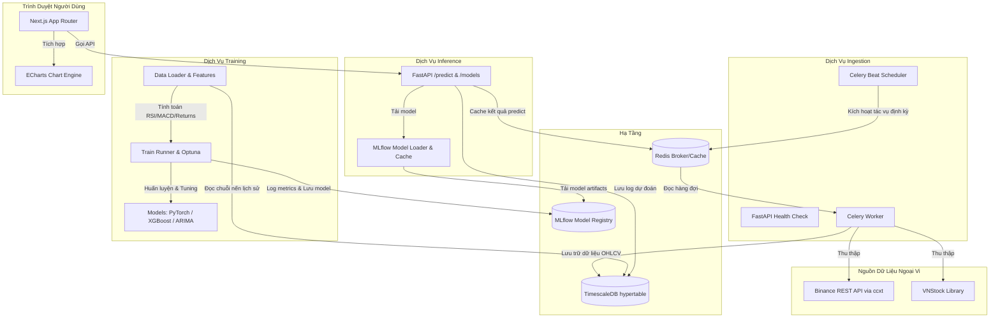

# Kiến Trúc Hệ Thống & Luồng Dữ Liệu

Tài liệu này mô tả kiến trúc tổng thể, mô hình thực thể liên kết (ERD) và luồng xử lý dữ liệu của hệ thống dự báo giá cổ phiếu & tiền số.

---

## 1. Sơ Đồ Kiến Trúc (Architecture Diagram)

Hệ thống được thiết kế theo kiến trúc hướng dịch vụ (microservices) để tách biệt tải thu thập dữ liệu (I/O bound), huấn luyện mô hình (CPU/GPU bound) và phục vụ dự đoán (low-latency).

---

## 2. Thiết Kế Cơ Sở Dữ Liệu (Database Design)

Chúng ta sử dụng **TimescaleDB** (phần mở rộng tối ưu hóa chuỗi thời gian của PostgreSQL). Bảng dữ liệu chính (`ohlcv_prices`) sẽ được cấu hình thành **Hypertable**, tự động phân mảnh (chunking) theo thời gian.

### 2.1 Bảng `tickers`
Lưu trữ danh sách các cổ phiếu và cặp tiền số được theo dõi.

| Cột | Kiểu | Mô tả |
| :--- | :--- | :--- |
| `id` | VARCHAR(50) (PK) | Mã định danh (Ví dụ: `FPT`, `BTC/USDT`) |
| `name` | VARCHAR(100) | Tên đầy đủ |
| `asset_type` | VARCHAR(20) | Loại tài sản: `stock` hoặc `crypto` |
| `exchange` | VARCHAR(50) | Tên sàn giao dịch (Ví dụ: `HOSE`, `Binance`) |
| `is_active` | BOOLEAN | Trạng thái hoạt động |
| `created_at` | TIMESTAMPTZ | Thời gian tạo |

### 2.2 Bảng `ohlcv_prices` (Hypertable)
Lưu trữ chuỗi giá lịch sử. Bảng này sẽ được phân mảnh theo cột `timestamp`.

| Cột | Kiểu | Mô tả |
| :--- | :--- | :--- |
| `timestamp` | TIMESTAMPTZ (PK) | Mốc thời gian (UTC) |
| `ticker_id` | VARCHAR(50) (PK/FK) | Tham chiếu đến bảng `tickers` |
| `resolution` | VARCHAR(5) (PK) | Khung thời gian: `1h`, `1d` |
| `open` | NUMERIC(18, 8) | Giá mở cửa |
| `high` | NUMERIC(18, 8) | Giá cao nhất |
| `low` | NUMERIC(18, 8) | Giá thấp nhất |
| `close` | NUMERIC(18, 8) | Giá đóng cửa |
| `volume` | NUMERIC(24, 8) | Khối lượng giao dịch |

### 2.3 Bảng `predictions`
Lưu trữ lịch sử dự đoán của mô hình để đánh giá hiệu năng thực tế.

| Cột | Kiểu | Mô tả |
| :--- | :--- | :--- |
| `id` | UUID (PK) | Định danh bản ghi dự đoán |
| `ticker_id` | VARCHAR(50) (FK) | Tham chiếu đến bảng `tickers` |
| `model_name` | VARCHAR(100) | Tên mô hình (Ví dụ: `xgboost_v1`, `lstm_v1`) |
| `prediction_time` | TIMESTAMPTZ | Thời điểm thực hiện dự báo |
| `target_time` | TIMESTAMPTZ | Thời điểm tương lai cần dự báo giá |
| `predicted_value` | NUMERIC(18, 8) | Giá trị dự báo |
| `actual_value` | NUMERIC(18, 8) | Giá trị thực tế sau khi backfill |

---

## 3. Luồng Dữ Liệu Thời Gian Thực & Huấn Luyện

1.  **Thu thập (Ingestion)**:
    *   `Celery Beat` kích hoạt định kỳ mỗi giờ (`1h` cho crypto) hoặc mỗi ngày (`1d` cho cổ phiếu & crypto).
    *   Worker gọi API Binance hoặc thư viện `vnstock` để cào dữ liệu mới nhất.
    *   Dữ liệu được làm sạch, chuyển đổi múi giờ sang UTC, và thực hiện câu lệnh `UPSERT` vào TimescaleDB.
2.  **Huấn luyện (Training)**:
    *   Nhà nghiên cứu chạy kịch bản huấn luyện.
    *   Hệ thống tải dữ liệu từ TimescaleDB, phân tách train/val/test theo trật tự thời gian (Time-series Split).
    *   Tính toán các đặc trưng (features) kỹ thuật: MACD, RSI, Volatility, Returns.
    *   Huấn luyện các mô hình. `Optuna` dò tìm siêu tham số.
    *   Model tốt nhất được log lên `MLflow` kèm chỉ số hiệu năng (MAE, RMSE, MAPE).
3.  **Phục vụ (Inference)**:
    *   Client gửi request POST `/predict` kèm `ticker_id` và `model_name`.
    *   Dịch vụ Inference kiểm tra cache Redis. Nếu có sẵn và chưa hết hạn, trả về ngay lập tức.
    *   Nếu cache-miss, `ModelLoader` tải model từ `MLflow Model Registry`, thực hiện dự đoán, ghi kết quả dự đoán vào Redis và Postgres, sau đó phản hồi Client.
